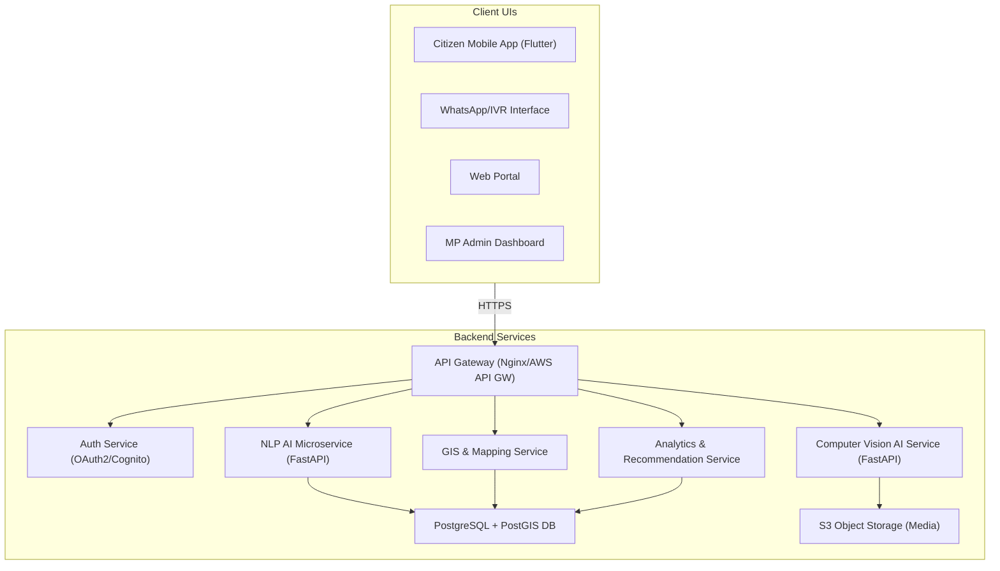
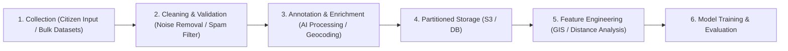

## What Is Implemented

- MP/admin dashboard for complaints, project prioritization, and GIS analysis
- Citizen intake views for mobile, WhatsApp, Jan Sabha, and web channels
- AI pipeline surfaces for speech, OCR, NLP, GIS enrichment, and priority scoring
- Architecture and security views mapped to the PDF sections
- Animated UI patterns inspired by Vengeance UI components such as bento grids, glow cards, animated numbers, and spotlight navigation

# Detailed Section-by-Section Explanation of the JanSevak AI Proposal

This document provides an exhaustive, section-by-section explanation of the JanMitra AI system design proposal, detailing every technical concept, architecture flow, model choice, database design, and implementation step outlined in the source document.

---

## 📋 Table of Contents
1. [Section 1: Understanding the Problem](#section-1-understanding-the-problem)
2. [Section 2: Project Vision & Success Metrics](#section-2-project-vision--success-metrics)
3. [Section 3: System Architecture](#section-3-system-architecture)
4. [Section 4: Complete Tech Stack](#section-4-complete-tech-stack)
5. [Section 5: AI Modules](#section-5-ai-modules)
6. [Section 6: Data Pipeline](#section-6-data-pipeline)
7. [Section 7: Database Design](#section-7-database-design)
8. [Section 8: API Design](#section-8-api-design)
9. [Section 9: Frontend](#section-9-frontend)
10. [Section 10: User Experience (UX)](#section-10-user-experience-ux)
11. [Section 11: GIS Module](#section-11-gis-module)
12. [Section 12: AI Priority Engine](#section-12-ai-priority-engine)
13. [Section 13: Security](#section-13-security)
14. [Section 14: Cloud Architecture (AWS)](#section-14-cloud-architecture-aws)
15. [Section 15: Project Structure](#section-15-project-structure)
16. [Section 16: Roadmap](#section-16-roadmap)
17. [Section 17: Implementation Guide](#section-17-implementation-guide)
18. [Section 18: Datasets](#section-18-datasets)
19. [Section 19: Learning Resources](#section-19-learning-resources)
20. [Section 20: SIH Winning Strategy](#section-20-sih-winning-strategy)
21. [Section 21: Future Scope](#section-21-future-scope)
22. [Section 22: Complete Cost Analysis](#section-22-complete-cost-analysis)
23. [Section 23: Final Implementation Checklist](#section-23-final-implementation-checklist)

---

## 🔍 Section 1: Understanding the Problem

### Current Workflow
* **How it works now:** Citizens submit complaints or development ideas through in-person public hearings (*Jan Sabhas*), physical letters, emails, social media, or national portals like **CPGRAMS** (Centralized Public Grievance Redress and Monitoring System).
* **The issue:** The collected data is logged manually into separate, isolated (siloed) departmental databases. Officials sort and route these manually, leading to delays and loss of data. There is no unified system that aggregates feedback from multiple channels (online and offline).

### Existing Problems
* **Rigid Platforms:** Current tools (like CPGRAMS) prioritize complex, bureaucratic classification forms over citizen usability.
* **Lack of Feedback:** Citizens rarely receive updates on their complaints, causing them to lose trust and stop reporting issues.
* **Duplicate Submissions:** Without automation, the same issue (e.g., a specific pothole) is reported by dozens of citizens separately. There is no automated system to detect duplicates or group related complaints.
* **No Data-Backed Prioritization:** Officials decide which projects to fund based on subjective judgment or political influence rather than objective data metrics.

### Why Current Systems Fail
* **Poor User Experience (UX):** Rural or low-literacy citizens struggle with complex online web forms. For example, in Kenya's *MajiVoice* water grievance system, 75% of complaints were submitted in person, and only 3% online, demonstrating the failure of digital interfaces to capture grassroots issues.
* **Siloed Structures:** Data transparency is absent, and the local Member of Parliament (MP) does not have a comprehensive, single-pane view of the constituency's needs.

### Stakeholders and Personas
* **Citizens:** Urban, rural, migrant workers, and senior citizens. They prefer different reporting channels: farmers need voice/IVR (Interactive Voice Response), youth prefer WhatsApp/apps, and professionals prefer web portals.
* **MPs and Staff:** Require high-level summarized insights, analytics, and prioritized project recommendations rather than sorting through thousands of raw complaints.
* **Bureaucrats/Civil Servants:** Require solutions that fit into existing government workflows and departmental pipelines.
* **NGOs/Media:** Press for system accountability and transparency.

### Functional Requirements
* Multi-modal entry channels: text, voice messages (transcribed), photos (potholes, garbage piles), and PDFs (scanned petitions).
* Multilingual support with automatic language detection and bidirectional translation.
* Backend automation: classification of complaints, GPS location detection, duplicate clustering, and prioritization ranking based on objective criteria.
* Interfaces: Citizen mobile app/portal, WhatsApp chatbot, and an MP/admin analytics dashboard with GIS mapping.

---

## 🎯 Section 2: Project Vision & Success Metrics

### Mission & Vision
* **Mission:** Empower Indian MPs and citizens with an AI-driven platform that crowdsources, analyzes, and translates constituency development inputs to identify and prioritize projects based on real data.
* **Vision:** A "Jan Sevak" system bridging the gap between grassroots needs and government execution, ensuring every citizen's voice is heard.

### Objectives
1. **Engage Citizens:** Frictionless reporting across multiple channels.
2. **Auto-Analyze Inputs:** Use NLP (Natural Language Processing) and Computer Vision to automatically tag, categorize, and cluster reports.
3. **Data Integration:** Combine citizen inputs with official public datasets (census, infrastructure maps).
4. **Intelligent Prioritization:** Rank proposals using an AI-driven scoring engine.
5. **Actionable Insights:** Present structured recommendations and alerts to officials.
6. **Trust & Transparency:** Allow citizens to track their complaint status and ensure data privacy (complying with the DPDP Act 2023).

### Success Metrics & KPIs
* **User Engagement:** Target of 100,000+ active users in the pilot phase.
* **Issue Resolution Rate:** The percentage of AI-flagged projects successfully adopted or executed by authorities.
* **Response Time:** AI clustering and routing of urgent reports to officials within 24 hours.
* **Accuracy:** Target of $\ge 90\%$ accuracy in topic classification, and $<5\%$ error in Optical Character Recognition (OCR).
* **System Reliability:** 99.9% uptime.

---

## 🏗️ Section 3: System Architecture

The proposal details a modern, cloud-native **Microservices Architecture**. Rather than running the system as one giant codebase, it is divided into isolated modules that communicate through APIs.



### Components:
* **API Gateway & Auth:** All client interfaces connect to the API Gateway, which handles SSL termination, routing, and token validation (OAuth2/OIDC via Keycloak or AWS Cognito).
* **Microservices:** Each AI model and business feature (NLP, Computer Vision, GIS, and Analytics) runs on its own isolated server. They can be updated or scaled independently.
* **Data Stores:**
  * **Relational Database:** PostgreSQL holds structured metadata (user details, complaint records, categories, and AI annotations) and uses the **PostGIS** extension to handle geographic coordinate points.
  * **Object Store:** AWS S3 holds raw files like voice recordings, PDFs, and uploaded images.
  * **Vector Database:** Pinecone or Milvus stores text embeddings to enable fast semantic similarity searches.

---

## 🛠️ Section 4: Complete Tech Stack

The proposal outlines a production-grade, open-source-friendly technology stack:

* **Frontend:**
  * **Flutter (Dart):** Cross-platform framework chosen for the citizen app to allow quick, single-codebase deployment to iOS and Android. It handles phone features like camera capturing and voice recording easily.
  * **React.js / Next.js:** Used for the web admin dashboard to ensure fast page loads and high accessibility.
* **Backend:**
  * **FastAPI (Python):** Selected for AI service development because Python is the native language for most machine learning frameworks, and FastAPI supports high-performance asynchronous execution.
* **AI & Machine Learning:**
  * **PyTorch:** The framework used to train and run deep learning models.
  * **Meta NLLB-200:** Translates 200 different languages and dialects with state-of-the-art accuracy.
  * **Meta Llama 3 (8B/70B):** Generates summaries and powers the conversational retrieval-augmented generation (RAG) assistant for the admin dashboard.
  * **OpenAI Whisper:** An open-source model used for highly accurate multilingual speech-to-text.
  * **Tesseract OCR / EasyOCR:** Extracts written text from photos of paper petitions.
  * **Sentence Transformers (SBERT):** Computes vector representations of texts to identify duplicate complaints semantically.
* **Database & Caching:**
  * **PostgreSQL + PostGIS:** Spatial database for geographical queries.
  * **Redis (ElastiCache):** In-memory cache used to keep track of user sessions and rate-limiting counters.
* **Infrastructure & DevOps:**
  * **Docker:** Containerizes all applications to ensure they run identically in local development and production.
  * **AWS EKS/ECS:** Manages and scales the Docker containers.
  * **Terraform:** Automatically provisions the cloud infrastructure.

---

## 🧠 Section 5: AI Modules

This section goes deep into the specific machine learning components:

* **Speech Recognition:** OpenAI Whisper transcribes IVR audio recordings or WhatsApp voice notes into text, targeting an error rate under 5%.
* **Optical Character Recognition (OCR):** Tesseract reads handwriting or printed fonts on scanned citizen submissions.
* **Language Detection & Translation:** Uses `fastText` to identify the incoming language, and NLLB-200 to translate it into English for analysis, providing a bidirectional translation loop back to the user.
* **Topic Classification:** A fine-tuned **DistilBERT** classifier scans the text of the complaint and automatically routes it to the appropriate department (e.g., "Roads," "Water Supply," "Sanitation").
* **Named Entity Recognition (NER):** Uses **spaCy** to extract landmarks, locations, and names (e.g., extracting "near Bus Stand" to help geolocate the complaint).
* **Sentiment Analysis:** Pre-trained **multilingual RoBERTa** analyzes the emotional tone of the complaint. High anger or panic scores trigger higher urgency metrics.
* **Duplicate & Similarity Detection:** Text complaints are converted to vector embeddings using SBERT. If the cosine similarity between two entries exceeds a threshold, they are flagged as duplicates. Photos are analyzed using perceptual hashing (pHash) to detect identical images.
* **Spam & Fake Detection:** A binary classifier flags gibberish or known spam formats. GPS location data is cross-checked with the text; if a user claims they are in Mumbai but the GPS points to Delhi, the system flags it.
* **Computer Vision (Civic Imagery):**
  * **Potholes & Road Damage:** Fine-tuned **YOLOv8** model identifies and localizes road defects.
  * **Garbage Piles:** YOLO classifies litter types (plastic, glass, organic) to prioritize sanitation routes.
  * **Flood Detection:** Integrates satellite imagery (Copernicus) with smartphone photos using **UNet segmentation** to outline flooded boundaries.
* **LLM Assistant (RAG):** Integrates **Llama 3** with the database. Officials can ask plain English questions like, *"List the top road complaints in ward 2 last week,"* and the LLM translates the query, fetches the database records, and summarizes them.

---

## 🚰 Section 6: Data Pipeline

The pipeline manages how data moves through the system from ingestion to inference:



1. **Data Collection:** Real-time citizen inputs are captured alongside scheduled batch imports of public shapefiles, meteorological data, and budget files.
2. **Cleaning & Validation:** Inputs are sanitized: empty records are discarded, text is standardized, and audio signals are checked for noise.
3. **Annotation & Enrichment:** AI models run inference to extract text, translate, classify, and attach spatial metadata.
4. **Storage:** Raw inputs go to S3. Processed metadata and vector embeddings are stored in partitioned tables in PostgreSQL and vector databases.
5. **Feature Engineering:** Computes spatial variables, such as distance to the nearest public facility (hospital or school) and population density around the coordinates.
6. **Model Training & Evaluation:** Models are retrained periodically using active learning, where low-confidence inputs are flagged for manual review and then added to the training set.

---

## 🗄️ Section 7: Database Design

The database schema uses a relational model optimized for spatial querying via PostGIS.

### Core Tables and Fields:
* **`User`:** Stores user profiles (id, name, contact info, system role, preferences).
* **`Complaint/Suggestion`:** The central transaction table.
  * Fields: `id`, `user_id` (Foreign Key referencing User), `timestamp`, `raw_text`, `category`, `location` (stored as a **PostGIS POINT** type), `status` (Enum: new, in-review, resolved), `priority_score`, `sentiment_score`.
* **`Media`:** Relates attachments to complaints (id, `complaint_id`, media type, S3 URI).
* **`AI_Analysis`:** Holds extracted text and NLP tags (id, `complaint_id`, `transcript_text`, `ocr_text`, `language_detected`, `classified_topic`, `entities`).
* **`Project`:** Aggregated plans recommended by the engine (id, description, budget, status, department).
* **`GeoArea`:** Geographic boundaries (stored as a **PostGIS POLYGON** type) representing wards or districts.

### Performance Tuning:
* **Spatial Indexes:** Uses **GIST (Generalized Search Tree) indexes** on map columns (`Complaint.location` and `GeoArea.geom`) to run lightning-fast geographic searches.
* **GIN Indexes:** Applied on text fields (`complaint.raw_text`) to enable full-text searching.
* **Data Partitioning:** Splits the `Complaint` table by month or geographical region to prevent slow query performance as millions of entries are written.
* **Caching:** Uses Redis to store frequently executed spatial query results.

---

## 🔌 Section 8: API Design

The API endpoints are designed following REST conventions and documented using the OpenAPI specification.

### Key Endpoint Routings:
* **Authentication:**
  * `POST /auth/register` - Registers a new user.
  * `POST /auth/login` - Authenticates credentials and returns a JSON Web Token (JWT) and a refresh token.
* **Complaints:**
  * `POST /complaints` - Submits a multi-part form payload containing text, GPS coordinates, and media files (images/audio).
  * `GET /complaints/{id}` - Retrieves the current status, translation, and AI tags of a complaint.
* **Analytics & Dashboard:**
  * `GET /mp-dashboard/recommendations` - Returns a sorted list of suggested projects based on priority scores.
  * `GET /analytics/trends` - Fetches time-series data showing trending complaints and submission frequencies.
  * `GET /gis/heatmap` - Takes `lat`, `lon`, and `radius` parameters to return a GeoJSON payload of complaint density for map rendering.

---

## 📱 Section 9: Frontend

The user interface layer is divided to meet the needs of different users:

### Citizen Mobile App
* **Report Screen:** Minimalist screen with large buttons allowing users to choose their input method: "Speak" (launches voice recording), "Type" (text field with language toggle), or "Photo" (launches camera).
* **Map View:** Uses Leaflet.js or Mapbox GL to show pushpins of issues nearby.
* **Progress Tracker:** Displays a progress bar tracking the user's issue through stages (Queued $\rightarrow$ Under Review $\rightarrow$ In Progress $\rightarrow$ Resolved).
* **Feedback Chat:** A RAG-driven conversational chatbot to answer user questions about issue resolutions.

### WhatsApp & IVR Interface
* Lightweight UX for users without smartphones.
* A Dialogflow or Rasa chatbot interacts with the citizen on WhatsApp, requesting details and location pins.
* Whispering transcribes voice calls over telephony lines.

### MP Dashboard
* **Home Screen:** Shows high-level KPIs (total submissions, unresolved counts, trending departments).
* **Map & List Views:** Displays a geographic heatmap overlaid with filters.
* **Detail View:** Shows side-by-side original text, translated English text, uploaded photos, and related clustered issues.
* **Budget Planner:** An interactive tool to distribute constituency funding using a **knapsack optimization algorithm** to maximize project coverage under budget caps.

---

## ♿ Section 10: User Experience (UX)

The user experience focuses on inclusivity and extreme accessibility:

* **Simple Navigation:** A simple tab-based navigation layout on mobile (Submit | Map | Status).
* **Accessibility (WCAG AA):** Large text fonts, voice-guided instructions for illiterate users, high-contrast layouts, and text transcripts of audio notes for hearing-impaired admins.
* **Offline Support:** The mobile app caches templates and coordinates locally. If there is no internet, it queues the report to upload automatically once connection is restored, or falls back to sending an encoded SMS/USSD text.
* **Security UX:** Uses secure One-Time Passwords (OTPs) instead of complex passwords for citizen login. Allows anonymous submissions to protect whistleblowers.
* **Dark Mode:** A built-in dark theme to reduce eye strain for citizens or officials working at night.

---

## 🗺️ Section 11: GIS Module

The Geographic Information System adds spatial layers to every data point:

* **Spatial Database:** Integrates administrative shapefiles from the Census of India to align latitude/longitude coordinates to specific administrative wards.
* **Heatmaps:** Uses **Kernel Density Estimation (KDE)** to generate spatial tiles of issue intensity.
* **Travel Time Analysis:** Integrates the Open Source Routing Machine (OSRM) to calculate how long it takes to travel from a complaint location to the nearest facility (e.g., a village located 15km from a clinic is flagged with higher priority).
* **Buffer Analysis:** Creates geographic buffers (e.g., a 2km radius circle around a water tank) to calculate how many homes are served by joining the buffer with gridded census population data points.
* **Road Network Analysis:** Merges multiple pothole complaints that fall on the same polyline segment of a road to avoid duplicate tickets.
* **Satellite Imagery:** Overlays Sentinel-2 satellite data on maps to provide context, particularly for disaster monitoring (like flooding).

---

## 📈 Section 12: AI Priority Engine

The system uses a Multi-Criteria Decision-Making (MCDM) model based on the **Analytic Hierarchy Process (AHP)** to score and rank project proposals.

### The Scoring Equation
The Priority Score is calculated as:

$$\text{PriorityScore} = \sum_{i=1}^{n} W_i \times S_i$$

Where:
* $S_i$ is the normalized sub-score for a specific factor (valued between 0 and 1).
* $W_i$ is the weight assigned to that factor (representing its political or structural importance).

### Evaluated Factors:
1. **Population Impact ($S_1$):** $\frac{\text{Population Affected}}{\text{Max Population in Region}}$
2. **Budget Efficiency ($S_2$):** Prioritizes low-cost, high-impact projects.
3. **Distance/Isolation ($S_3$):** Measured travel distance to central services.
4. **Severity/Frequency ($S_4$):** $\frac{\text{Reports Count}}{\text{Max Complaints for Any Issue}}$
5. **Government Policy Alignment ($S_5$):** Boosts points if the project aligns with state goals (e.g., irrigation).
6. **Infrastructure Gap ($S_6$):** Weights based on current regional deficits.
7. **Climate/Disaster Risk ($S_7$):** Higher priority for flood/drought zones.
8. **Social Equity ($S_8$):** Extra points for projects serving marginalized areas.
9. **Citizen Upvotes ($S_9$):** Democratic score boost based on user upvotes.

*An illustrative formula is proposed:*

$$\text{Score} = 0.3S_{\text{population}} + 0.2S_{\text{frequency}} + 0.2S_{\text{cost}} + 0.1S_{\text{distance}} + 0.1S_{\text{govt}} + 0.1S_{\text{vulnerable}}$$

---

## 🔒 Section 13: Security

* **Authentication:** Role-Based Access Control (RBAC) restricts actions. For example, only authenticated admins can approve budgets or delete entries.
* **Data Encryption:** TLS/HTTPS secures data in transit. At-rest databases and S3 files are locked using AES-256 encryption.
* **Data Privacy:** Fully compliant with India’s **DPDP Act (2023)**. Users must consent to data processing, have the right to request deletion, and locations are blurred in public analytics views.
* **Cybersecurity:**
  * Network isolation inside an AWS **Virtual Private Cloud (VPC)**.
  * No public access allowed to the backend databases.
  * Continuous vulnerability scans run on Docker images.
  * Logging of user access using JWT transaction IDs (JTI) to maintain audit trails.

---

## ☁️ Section 14: Cloud Architecture (AWS)

The platform is designed to scale dynamically on AWS:

* **EC2:** Hosts GPU instances for model training and batch inference.
* **ECS/EKS with Fargate:** Runs containerized FastAPI services. Fargate runs serverless containers, meaning developers don't have to manage the underlying servers.
* **Lambda:** Handles event-driven tasks (e.g., when a photo is uploaded to S3, a Lambda function instantly triggers the YOLOv8 image processing worker).
* **RDS:** PostgreSQL with Multi-Availability Zone (Multi-AZ) replication for automatic database backups and failover protection.
* **CloudWatch & Prometheus:** Monitored metrics track server CPU spikes and system errors.

### The Deployment Flow
```text
Developer Push Code (GitHub) 
   └── CI/CD build Docker images & push to Amazon ECR
         └── Terraform scripts run infrastructure changes
               └── ECS pulls the new containers
                     └── CloudFormation updates Balancers and IAM roles
```

---

## 📁 Section 15: Project Structure

This section outlines the directory structure of the repository. It separates concerns cleanly between the `backend`, `frontend`, machine learning weights (`ai_models`), GIS scripts (`gis_data`), and configuration files (`infra`). Details are mapped out in the root [Project Structure directory tree](#-project-structure).

---

## 📅 Section 16: Roadmap

The timeline outlines a phased plan to scale the project:

### 7-Day Plan (Week 1)
* **Day 1:** Kickoff, repository setup, basic database schema design.
* **Days 2-3:** Implement user signup/login APIs, scaffold basic mobile app.
* **Days 4-5:** Code the main Complaint API and integrate PostgreSQL. Build Whisper transcription wrapper.
* **Days 6-7:** Connect mobile UI with backend to test text submissions. Set up task tracking.

### 30-Day Plan (Month 1)
* **By Day 14:** Core AI pipelines functioning (Whisper Speech-to-Text and Tesseract OCR).
* **By Day 21:** Integrate translation services and insert coordinates into PostGIS. Build first draft of the admin dashboard.
* **By Day 30:** Build the priority scoring algorithm. Deploy SNS notification service.

### 90-Day Plan (Months 2-3)
* Deploy the application in a pilot constituency to collect real-world feedback.
* Refine NLP classifiers and duplicate detection models with labeled user data.
* Integrate GIS mapping features (heatmaps, routing).

---

## 🛠️ Section 17: Implementation Guide

A developer's checklist for setting up the environment:

1. **Install Prerequisites:** Python, Node.js, Git, Docker, and Flutter SDK.
2. **Backend Setup:** Clone code, create virtual environment, run `pip install` for FastAPI, SQLAlchemy, and psycopg2. Run migrations using **Alembic** to build the database tables.
3. **Mobile Setup:** Open `/mobile_app`, add camera/mic permissions to AndroidManifest/Info.plist, run `flutter build apk --release`.
4. **Web Setup:** Run `npm install` inside `/web_app` and deploy to Nginx/S3.
5. **AI Model Paths:** Download Whisper, NLLB-200, and YOLOv8 weights and place them inside the `/ai_models` folder.
6. **AWS Infrastructure:** Set up S3 buckets, SQS queues, and RDS instances via the AWS console or Terraform.

---

## 📊 Section 18: Datasets

The system leverages open-source data to avoid licensing fees:
* **Census of India 2011:** Tabular data and boundary files.
* **OpenStreetMap (OSM):** Geofabrik extracts of road networks and point-of-interest indicators.
* **Bhuvan (ISRO):** WMS map layers for base mapping.
* **PM GatiShakti Portal:** GIS infrastructure layers (railways, highways).
* **IMD APIs:** Indian meteorological APIs for rainfall and flood forecasting.

---

## 📚 Section 19: Learning Resources

Recommends books and reference repositories to help the development team upskill:
* *Designing Data-Intensive Applications* for database and systems design.
* Hugging Face Transformers documentation.
* PostGIS documentation for spatial SQL queries.
* Reference repos like the open-source **FixMyStreet** application.

---

## 🚀 Section 20: Future Scope

Details the vision for scaling JanMitra beyond a basic complaint portal:
* **Digital Twin:** Integrating 3D graphics (Unity/Cesium) to simulate the physical impact of new construction projects on traffic and the environment.
* **Multi-Agent AI:** Employing virtual AI agents that represent different departments to debate and negotiate project allocations automatically.
* **Drones & IoT:** Deploying drones to verify photo submissions and IoT sensors to monitor noise/air pollution levels in real-time.
* **Predictive Governance:** Analyzing long-term trends to predict citizen needs, potential infrastructure failures, or civic unrest.

---
